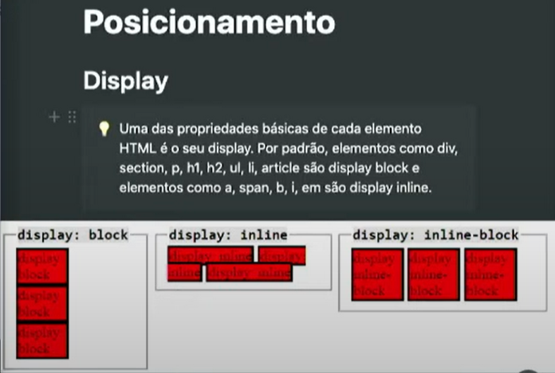

**Usando DISPLAY no CSS**
* Autor: AJSG :computer:
* [Github](https://github.com/airtonjsg/css-entendendo-o-display)

**Descrição**
Neste exemplo mostramos como usar o display no css.

* display: inline;
* display: block;
* display: inline-block;
* display: none;

* 

